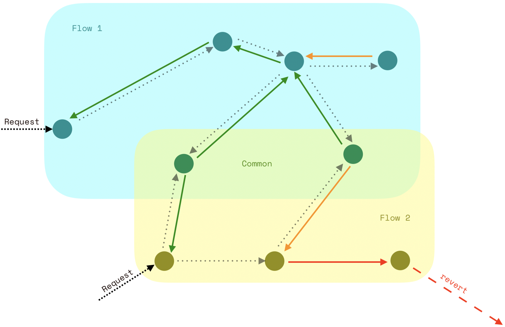

## Open Services for Web3

[`FISSION`](https://fission.codes) is a set of useful status codes and translated messages to connect smart contracts of all kinds

 

# Table of Contents

* [TL;DR](#tldr)
* [Services](#services)

# TL;DR

Open services are the combination of open source with shared state. There are many cases where the state is equally (or more) important than the code. These are long-running, hosted services that consolidate state and interoperate with others to be more than the sum of their parts.

# Services

* Tokens (Fungible)
  * [ ] ERC20
  * [ ] Advanced Token ERC777
* [ ] NFT (ERC721)
* [ ] Token Validator (ERC902)
* [ ] Security Token (modified ERC1400)
* [ ] Escrow
* Pseudo-Actors
  * [ ] Erlang-style Mailbox
  * [ ] Push/Pull Interface
  * [ ] PubSub
* [ ] Access Control List (ACL)
* Decentralized Autonomous Organizations (DAO)
  * [ ] Moloch
